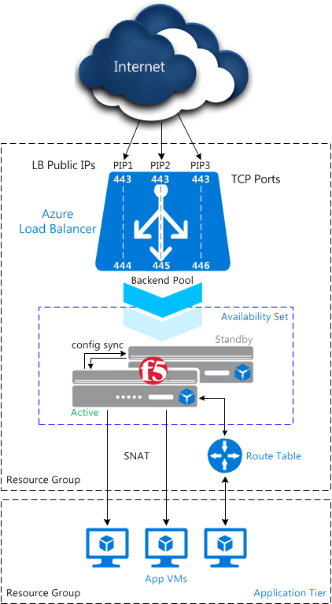
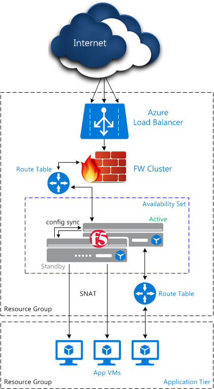

# &nbsp;&nbsp;F5 High Availability in Microsoft Azure
[](https://github.com/ArtiomL/f5-azure-ha/releases)
[](https://github.com/ArtiomL/f5-azure-ha/commits/master)
[](https://github.com/ArtiomL/f5-azure-ha/graphs/code-frequency)
[](https://github.com/ArtiomL/f5-azure-ha/issues)

[](/LICENSE)

&nbsp;&nbsp;

## Table of Contents
- [Description](#description)
- [Topology](#topology)
- [Installation](#installation)
	- [cfg_sync.sh](#cfg_syncsh)
	- [azure_ad_app.ps1](#azure_ad_appps1)
	- [azure_ha.py](#azure_hapy)
- [Logging](#logging)
- [Help](#--help)
- [License](LICENSE)

&nbsp;&nbsp;

## Description

In a regular F5 Device Service Clustering working in High Availability mode, cluster members use Gratuitous ARP or MAC Masquerade during normal operation and when cluster failover occurs.

In Azure this is implemented by making RESTful API calls to Azure Resource Manager.

However, this isn't currently implemented by F5:
> The two BIG-IP VEs are synchronizing their configurations to one another; they are not communicating for the purpose of failover. The BIG-IP VE high availability feature does not work in Azure, and you cannot create an **active-standby** pair.

 ([Source](https://support.f5.com/kb/en-us/products/big-ip_ltm/manuals/product/bigip-ve-setup-msft-azure-12-0-0/3.html))
 
 Attempting to enable Network Failover will result in the following error message:

> :warning: 01071ac2:3: Device-group (/Common/dg_HA): network-failover property must be disabled in VE-1NIC.

&nbsp;&nbsp;

The code in this repository is the proposed API-based failover solution for BIG-IP HA in Microsoft Azure.

Updating both the Azure Load Balancer (LBAZ) and Route Tables (UDR) is supported.

The HA / failover logic is designed to run on BIG-IPs, which is why only standard Python libraries were used:
```python
import argparse
import atexit
import datetime
import json
import os
import requests
import signal
import socket
import subprocess
import sys
import time
```

The minimum supported TMOS version is **12.1** (the first version to include the Python `requests` HTTP library).

&nbsp;&nbsp;

## Topology
Supported (and recommended) designs:
<p align="center"></p>
&nbsp;&nbsp;

&nbsp;&nbsp;

<p align="center"></p>
&nbsp;&nbsp;

Notes:
- Both **Public** (external) and **Internal** Azure Load Balancers are supported (`-b` to set LB name)
- Using Route Tables (to route outbound traffic via BIG-IPs) is **optional**
- Updating (multiple) Route Tables (**in addition** to LBAZ) during a single failover event is supported (`-r`)
- Updating (multiple) Route Tables _only_ (**no** LBAZ) is also supported (`-u` for UDR-only failover)
- Use [this](https://github.com/ArtiomL/f5networks/blob/master/azure/lbaz_mpips.ps1) script if you need help setting up LB rules with multiple public IPs

&nbsp;&nbsp;

## Installation
### [cfg_sync.sh](cfg_sync.sh)
First, make sure you follow these steps to enable config sync ([Manual Chapter](https://support.f5.com/kb/en-us/products/big-ip_ltm/manuals/product/bigip-ve-setup-msft-azure-12-0-0/3.html)):
```shell
# Disable functionality that enforces single NIC setup
tmsh modify /sys db provision.1nicautoconfig value disable

# Confirm that the value was set correctly
tmsh list /sys db provision.1nicautoconfig

# Ensure that both BIG-IP VEs are running the same version of system software
tmsh show /sys version

# On each BIG-IP VE, specify the Azure static private IP address as the self IP address for config sync
tmsh modify /cm device <bigipX> configsync-ip <self-ip>

# Establish device trust: On one BIG-IP VE, enter the private IP address of the other BIG-IP VE, along with the username and password
tmsh modify /cm trust-domain add-device { device-ip <peer-ip> device-name <bigipY> username <username> password <password> }

# Create a sync-failover device group with network failover disabled
tmsh create /cm device-group <device-group> devices add { <all-device-names-separated-by-space> } type sync-failover auto-sync enabled network-failover disabled

# Sync one BIG-IP VE to the other
tmsh run /cm config-sync to-group <device-group>
```

&nbsp;&nbsp;

### [azure_ad_app.ps1](azure_ad_app.ps1)

To be able to make API calls automatically, the two HA members must be provided with Azure Active Directory credentials ([azure_ha.json](azure_ha.json)) using the Azure Role-Based Access Control (RBAC).

This PowerShell code ([azure_ad_app.ps1](azure_ad_app.ps1)) automates this **one-time** process, while some user input is still required:

```powershell
# Login to Azure RM
Login-AzureRmAccount

# Show all subscriptions
Get-AzureRmSubscription

# Select the subscription where the AD resides
$adSub = Get-AzureRmSubscription -SubscriptionName "Paper Street Soap"
$adSub | Select-AzureRmSubscription

# Record IDs
$subsID = $adSub.SubscriptionId
$tenantID = $adSub.TenantId

# AD application password
$adaPass = Read-Host 'Azure AD App Password:' -AsSecureString
$adaPass = [Runtime.InteropServices.Marshal]::PtrToStringAuto([Runtime.InteropServices.Marshal]::SecureStringToBSTR($adaPass))

# Create a new AAD application
$armADApp = New-AzureRmADApplication -DisplayName "adappREST" -HomePage "https://paperstsoap.com/adapprest" -IdentifierUris "https://paperstsoap.com/adapprest" -Password $adaPass

# Record the application ID
$appID = $armADApp.ApplicationId.Guid

# Create a new SPN
New-AzureRmADServicePrincipal -ApplicationId $appID

# Assign a new role
New-AzureRmRoleAssignment -RoleDefinitionName Contributor -ServicePrincipalName $appID

# Show all resource groups
Get-AzureRmResourceGroup

# Select the resource group where the Azure Load Balancer (LBAZ), F5 VMs and their availability set reside
$rgName = "rgPAPERSTSOAP"

# Record F5 VMs' NICs
$nicF5A = ((Get-AzureRmVM -ResourceGroupName $rgName -Name ((Get-AzureRmAvailabilitySet -ResourceGroupName $rgName).VirtualMachinesReferences[0].Id -split 'virtualMachines/')[1]).NetworkInterfaceIDs -split 'networkInterfaces/')[1]
$nicF5B = ((Get-AzureRmVM -ResourceGroupName $rgName -Name ((Get-AzureRmAvailabilitySet -ResourceGroupName $rgName).VirtualMachinesReferences[1].Id -split 'virtualMachines/')[1]).NetworkInterfaceIDs -split 'networkInterfaces/')[1]

# Encode the password
$adaPass = [System.Convert]::ToBase64String([System.Text.Encoding]::UTF8.GetBytes($adaPass))

# Add "f5-azure-ha" tag to the resource group
$rgTags = (Get-AzureRmResourceGroup -Name $rgName).Tags
$rgTags += @{ Name = "f5-azure-ha"; Value="provisioned" }
Set-AzureRmResourceGroup -Name $rgName -Tag $rgTags

# JSON values
@{ "subID" = $subsID; "tenantID" = $tenantID; "appID" = $appID; "pass" = $adaPass; "rgName" = $rgName; "nicF5A" = $nicF5A; "nicF5B" = $nicF5B } | ConvertTo-Json
```

&nbsp;&nbsp;

This will result in a [`JSON`](azure_ha.json) file, similar to the following:
```json
{
	"appID": "a3e3cf25-2db0-432e-a122-8224cd46215a",
	"nicF5A": "vmf5a402",
	"nicF5B": "vmf5b513",
	"pass": "U2ViYXN0aWFu",
	"rgName": "rgPAPERSTSOAP",
	"subID": "b3481899-362a-4121-9355-1c4fa3e14b3d",
	"tenantID": "6a0a327e-6612-424d-bb4d-5420ca02b9a7"
}
```

&nbsp;&nbsp;

This file should be placed at the following location on both HA BIG-IPs: `/shared/tmp/scripts/azure/azure_ha.json`
Alternatively, this path is controlled by the `-c` command line argument or the `strCFile` attribute of the `clsAREA` class (in [azure_ha.py](azure_ha.py)):
```python
# Azure RM REST API
class clsAREA(object):
	def __init__(self):
		self.strCFile = '/shared/tmp/scripts/azure/azure_ha.json'
```

&nbsp;&nbsp;

### [azure_ha.py](azure_ha.py)

This is the actual HA / failover logic.

The file can be used as an [external monitor](https://devcentral.f5.com/articles/ltm-external-monitors-the-basics), but this is not recommended, since currently the Azure RM API takes up to [3 minutes](https://github.com/ArtiomL/f5-azure-ha/issues/7) to successfully complete PUT transactions.

Instead, use [SOL14397](https://support.f5.com/kb/en-us/solutions/public/14000/300/sol14397.html) to run this program based on a `monitor status down` mcpd syslog message. These messages should not be [ throttled](https://support.f5.com/kb/en-us/solutions/public/11000/900/sol11934.html).

Set up simple node monitors between the two BIG-IPs, and execute [azure_ha.py](azure_ha.py) with arguments relevant to your environment whenever the local monitor reports peer status down. For example:

#### Monitors and Nodes
```
ltm monitor tcp-half-open mon_HA_22 {
	defaults-from tcp_half_open
	destination *:ssh
	interval 3
	time-until-up 0
	timeout 10
}

ltm monitor tcp-half-open mon_HA_443 {
	defaults-from tcp_half_open
	destination *:https
	interval 3
	time-until-up 0
	timeout 10
}

ltm node node_vmF5A {
	address 10.1.1.245
	monitor min 1 of { icmp mon_HA_22 mon_HA_443 }
	session monitor-enabled
	state up
}

ltm node node_vmF5B {
	address 10.1.1.246
	monitor min 1 of { icmp mon_HA_22 mon_HA_443 }
	session monitor-enabled
	state up
}
```

#### /config/user_alert.conf

> vmF5A:

```shell
alert alrt_AZURE_HA "Node /Common/node_vmF5B address 10.1.1.246 monitor status down" {
	exec command = "/shared/tmp/scripts/azure/azure_ha.py -l2 -f -b lbazEXTERNAL -r udrWEBSRVs"
}
```

> vmF5B:

```shell
alert alrt_AZURE_HA "Node /Common/node_vmF5A address 10.1.1.245 monitor status down" {
	exec command = "/shared/tmp/scripts/azure/azure_ha.py -l2 -f -b lbazEXTERNAL -r udrWEBSRVs"
}
```

&nbsp;&nbsp;

## Logging
All logging is **disabled** by default. Please use the `-l {0,1,2,3}` argument to set the required verbosity.
&nbsp;&nbsp;

Alternatively, this is controlled by the global `intLogLevel` variable:
```python
# Log level to /var/log/ltm (or stdout)
intLogLevel = 0
```
If run interactively, **_stdout_** is used for log messages (`intLogLevel = 1`), otherwise `/var/log/ltm` will be used.

&nbsp;&nbsp;

## --help
```
./azure_ha.py --help
usage: azure_ha.py [-h] [-a] [-b LBAZ] [-c CFILE] [-f] [-l {0,1,2,3}]
                   [-r UDR [UDR ...]] [-s] [-u] [-v]
                   [IP] [PORT]

F5 High Availability in Microsoft Azure

positional arguments:
  IP                peer IP address (required in monitor mode)
  PORT              peer HTTPS port (default: 443)

optional arguments:
  -h, --help        show this help message and exit
  -a                test Azure RM authentication and exit
  -b LBAZ           Azure LB name (first LB is used if omitted)
  -c CFILE          config file location
  -f                force failover
  -l {0,1,2,3}      set log level (default: 0)
  -r UDR [UDR ...]  list of route tables to update
  -s                check current HA state and exit
  -u                UDR mode failover (-r is required)
  -v                show program's version number and exit

https://github.com/ArtiomL/f5-azure-ha
```
